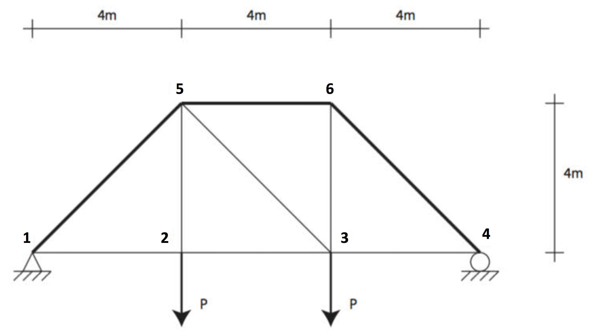

---
page_template: vega.html
...

# Forward Propagation - OpenSees/Tcl

|  |  |
|----------|------|
| Problem files | [quo-01](https://github.com/claudioperez/SimCenterDocumentation/tree/examples/docs/common/user_manual/examples/desktop/quoFEM/src/quo-01) |

This example uses quoFEM to estimate the first and second central moments of a FE model's response, given the marginal distributions of various random parameters.

Consider the problem of uncertainty quantification in a two-dimensional truss structure shown in the following figure. Two input scripts are used to define a forward propagation procedure to be coordinated by quoFEM which will estimate the mean and standard deviation of the vertical displacement at node 3 using Latin hypercube sampling.

{width="400"}

The following parameters are defined in the **RV** tab:

1. Elastic modulus, `E`: **Weibull** distribution with a  scale parameter $(\lambda)$ of $210.0$,  shape parameter $(k)$ of $20.0$, 

1. Load magnitude, `P`: **Beta** distribution with a  first shape parameter $(\alpha)$ of $2.0$,  second shape parameter $(\beta)$ of $2.0$,  lower bound $(L_B)$ of $20.0$,  upper bound $(U_B)$ of $30.0$, 

1. Cross sectional area for the other six bars, `Ao`: **Lognormal** distribution with a  mean $(\mu)$ of $250.0$,  standard deviation $(\sigma)$ of $50.0$, 

1. Cross sectional area for the upper three bars, `Au`: **Normal** distribution with a  mean $(\mu)$ of $500.0$,  standard deviation $(\sigma)$ of $100.0$, 

## UQ Workflow

To define the uncertainty workflow in quoFEM, select **Forward Propagation** for the **Dakota Method Category**, and enter the following inputs:

|   |   |
|---|---|
| **Method** | LHS |
| **Samples** | 200 |
| **Seed** | 949 |

## Model Files

The following files make up the **FEM** model definition.

#. [TrussModel.tcl](src/TrussModel.tcl): This file is an OpenSees Tcl script that constructs and runs a finite element analysis of the truss for a given realization of the problem's random variables. It is supplied to the **Input File** field of the **FEM** tab.

#. [TrussPost.tcl](src/TrussPost.tcl): This file is an OpenSees Tcl script that processes the QoI identifiers supplied in the **QoI** tab, and writes the relevant response quantities to `results.out` from an OpenSees process. It is supplied to the **Postprocess File** field of the **FEM** tab.

## Results

The results from this analysis with a maximum of $200$ iterations are as follows: 

**Node 3**:

- $\mu = 7.6986$
- $\sigma = 1.5666$

**Node 2**:

- $\mu = 9.3967$
- $\sigma = 1.8628$

If the user selects **Data** in the **RES** tab, they will be presented with both a graphical plot and a tabular listing of the data. Various views of the graphical display can be obtained by left- and right-clicking the columns of the tabular data. If a singular column of the tabular data is selected with simultaneous right and left clicks, a frequency and CDF will be displayed.

<!--  -->

